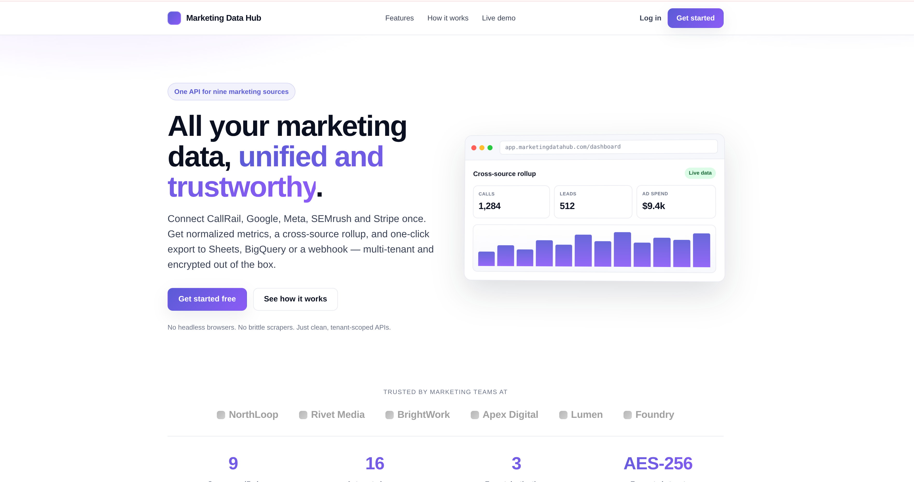
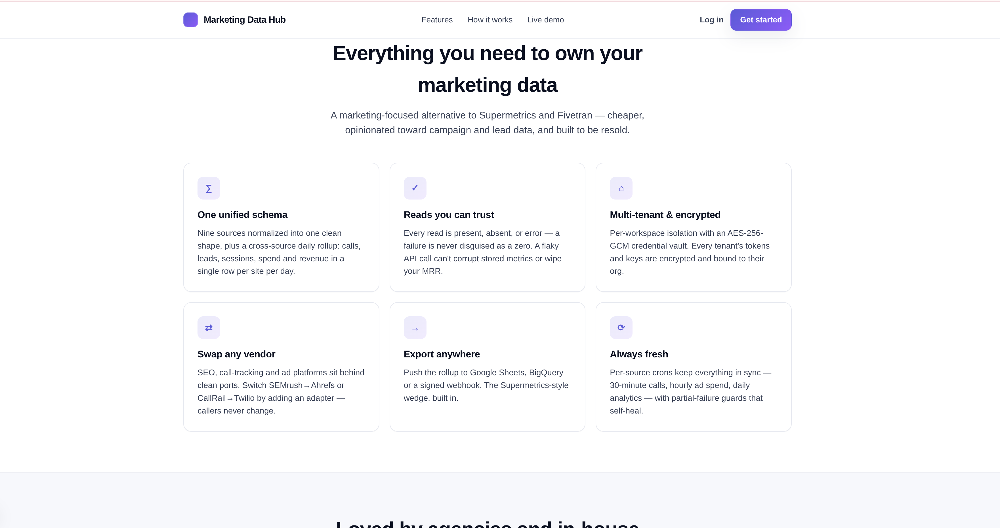
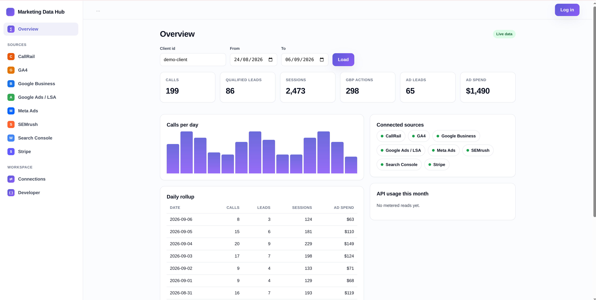
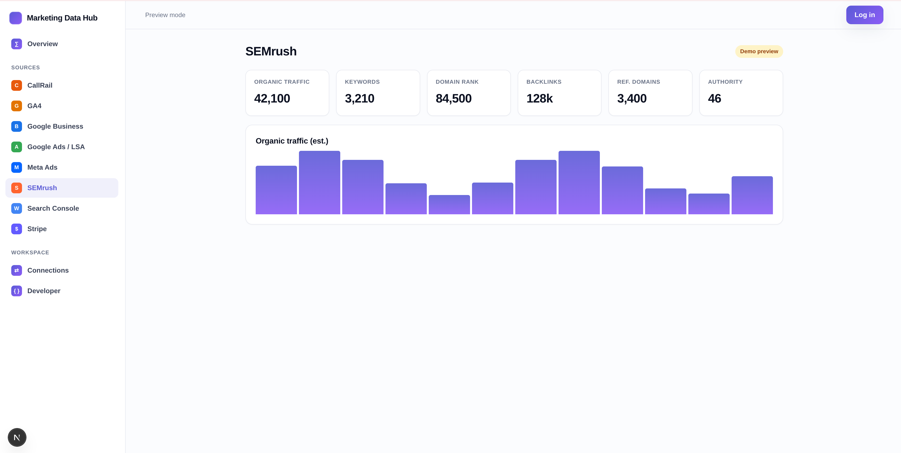
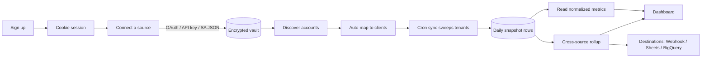

<div align="center">

# 📊 Marketing Data Hub

### One clean, tenant-scoped API for all your marketing data.

CallRail · GA4 · Google Business Profile · Search Console · Google Ads / LSA · Meta Ads · SEMrush · Stripe
— unified, normalized, and honest about what it doesn't know.

**A self-hostable, open-source alternative to Supermetrics & Fivetran, opinionated toward campaign and lead data.**

[](https://nextjs.org)
[](https://react.dev)
[](https://www.typescriptlang.org)
[](https://www.mongodb.com)
[](#-testing)
[](./LICENSE)

[Live Demo](#-screenshots) · [Quick Start](#-quick-start) · [API](#-api-reference) · [Architecture](#-architecture) · [Add a Connector](#-extending-add-a-connector)

</div>

---

## ✨ Why this exists

Every marketing agency and in-house team drowns in the same problem: the numbers that matter live in
**eight different dashboards**, each with its own login, its own schema, its own idea of what "a lead"
is. Stitching them together by hand is a weekly tax.

**Marketing Data Hub** does that stitching once, correctly, and gives you **a single normalized API**
per workspace. The moat isn't the fetching — it's the *normalization discipline*: every connector
carries its own auth, pagination, retry logic, and one hard rule that most ETL tools quietly break:

> **A read failure is never reported as a zero.** Every metric read returns one of three states —
> `present` (real data), `absent` (authoritatively nothing), or `error` (we couldn't find out). A broken
> API call surfaces as a `502`, never a silent `0` that poisons your reports.

That single invariant — enforced end to end — is what separates a dashboard you can trust from one you
can't.

---

## 📸 Screenshots

### Landing page

*One API for nine marketing sources — the marketing site leads with the product's core promise:
unified, normalized, and trustworthy data.*



*Every feature reinforces the moat — one unified schema, honest reads, multi-tenant encryption,
swappable vendors, export anywhere, always fresh.*



### Dashboard — cross-source overview

*A sidebar app-shell with every source in the rail, a KPI grid rolled up across connectors, a
per-day chart, and the "Connected sources" panel. The green **Live data** badge means these numbers
came back `present` — not a fabricated zero.*



### Per-source view

*Each source gets its own view with normalized KPIs and a chart. Here SEMrush shows organic traffic,
keywords, domain rank, backlinks, and authority. The amber **Demo preview** badge is honest about the
state — this is sample data, not a live read.*



> **Still to capture** (drop into `docs/screenshots/` with these names to light them up):
> `service-empty.png` (the **Not connected** empty state + Connect prompt), `connections.png`
> (Connections tab with per-source status pills), `developer.png` (API-key management), and a
> `connect-flow.gif` of clicking an unconnected source → **Connect** → the flashing Connections card.

---

## 🔌 Supported connectors

Eight production connectors, each hardened against a flaky third-party API. All of them do the same
three jobs — **authenticate → fetch → normalize into daily snapshot rows keyed to a mapped account** —
and all of them honor the three-state invariant.

| Connector | Source | Core metrics | Auth model |
|---|---|---|---|
| **CallRail** | Call tracking | Calls, answered/missed, qualified leads, durations, AI lead classification | API key |
| **Google Analytics 4** | Web analytics | Sessions, users, conversions, channels, top pages, lead events | Service account |
| **Google Business Profile** | Local search | Search/maps views, calls, directions, website clicks, reviews | OAuth |
| **Google Search Console** | Organic search | Clicks, impressions, CTR, position, top queries/pages | Service account |
| **Google Ads / LSA** | Local Services Ads | Leads by type, charge state, spend, impressions, budget utilization | OAuth (MCC or per-tenant) |
| **Meta / Facebook Ads** | Paid social | Spend, impressions, CTR, CPC, leads, CPL, campaigns | OAuth token |
| **SEMrush** | SEO intelligence | Keyword ranks, volumes, backlinks, authority, site audit | API key |
| **Stripe** | Billing | MRR, gross volume, subscriptions, failed payments, refunds | Secret key |

**AI lead classification** (CallRail): call transcriptions are labelled `new_estimate` /
`active_job_followup` / `service_inquiry` / `junk` via a **provider-agnostic LLM layer** (Anthropic
adapter + a deterministic fake for tests).

---

## 🎯 Features

- **Unified read API** — `GET /api/v1/{source}/metrics` returns the same normalized shape for every
  source. Learn it once.
- **Cross-source rollups** — `GET /api/v1/rollup` merges every connected source into one KPI payload per
  client.
- **Multi-tenant by construction** — every row is scoped to an `orgId`; repos are `orgId`-bound
  (`repos(orgId)`) as a Postgres-RLS replacement. One workspace can never read another's data.
- **Bring-your-own credentials** — each tenant stores their *own* OAuth apps, service accounts, API
  keys, and LLM config. Resolution is **vault-first, env-fallback**, so you can run single-tenant from
  env vars or full multi-tenant from the vault with the same code.
- **Encrypted credential vault** — AES-256-GCM with AAD binding; secrets are decrypted server-side only,
  never returned to the client. API keys and session tokens are stored as irreversible SHA-256 hashes.
- **Ports & adapters** — SEO, call-tracking, and paid-ads are behind vendor-agnostic ports. Swap SEMrush
  for another SEO vendor, or add CallTrackingMetrics, by writing one adapter file — routes and tests
  don't change.
- **Honest empty/loading/live/error states** — the dashboard shows demo data when logged out, a real
  **Connect this source** empty state when logged in but unconnected, and live data once connected. No
  fake numbers, ever.
- **Cron-driven freshness** — 16 scheduled jobs sweep every tenant; a per-tenant failure is counted as
  `partial` and **never wipes stored data**.
- **Pluggable destinations** — push normalized rollups to a **Webhook**, **Google Sheets**, or
  **BigQuery**.
- **Cookie sessions + bearer API keys** — a real signup → login → dashboard flow, plus programmatic API
  keys for machine access, unified behind one `getSession(req)`.
- **239 tests** across 28 files — the deterministic logic (normalization, retry discipline, three-state
  reads) is fully covered with injectable fakes.

---

## 🏗️ Architecture

```
                          ┌─────────────────────────────────────────────┐
   Browser / API client   │                Next.js 16 App                │
   ──────────────────────▶│  app/  (marketing site · dashboard · /api)   │
                          └───────────────┬─────────────────────────────┘
                                          │  thin route handlers
                                          ▼
                          ┌─────────────────────────────────────────────┐
                          │      hub-app/  (framework-agnostic core)     │
                          │  handlers → { status, body }   crons → summary│
                          └───────┬───────────────────────┬─────────────┘
                                  │                        │
                   getSession(req)│                        │ repos(orgId)  ◀── tenant isolation
                                  ▼                        ▼
      ┌────────────────────────────────┐   ┌───────────────────────────────────┐
      │  Ports & adapters              │   │  MongoDB (mongodb v6)              │
      │  • seo/     (SEMrush adapter)  │   │  • integrations  (encrypted vault) │
      │  • calltracking/ (CallRail)    │   │  • *_snapshots   (daily rows)      │
      │  • ads/     (Meta + Google)    │   │  • mappings, sync_log, sessions    │
      │  • destinations/ (WH/Sheets/BQ)│   │  orgId-scoped, unique-indexed      │
      │  • llm/     (Anthropic + Fake) │   └───────────────────────────────────┘
      └───────────────┬────────────────┘
                      │ injectable gateways (Fetcher, Ga4Gateway, StripeGateway, …)
                      ▼
      CallRail · GA4 · GBP · GSC · Google Ads · Meta · SEMrush · Stripe
```

### Design principles

1. **The core doesn't import Next.** `hub-app/*` handlers return `{ status, body }` and crons return
   summaries. The Next route handlers are a thin mounting layer — you could mount the same core in any
   host framework (see [`WIRING.md`](./WIRING.md)).
2. **Ports & adapters everywhere the vendor might change.** Callers depend on a port
   (`SeoProvider`, `CallTrackingProvider`, `PaidAdsProvider`) and get **normalized** output regardless
   of vendor. Adding a vendor is one adapter file plus one `case`.
3. **Three-state reads are non-negotiable.** `present → 200 {data}`, `absent → 404 {error:"not_connected"}`,
   `error → 502 {error}`. Capabilities a vendor lacks return `unsupported_capability:*`, never a fake zero.
4. **Injectable seams for testability.** Every external SDK sits behind a gateway interface
   (`Fetcher`, `Ga4Gateway`, `GscGateway`, `LsaGateway`, `StripeGateway`) so the deterministic logic is
   fully unit-tested with fakes and the real clients are built only at the production entrypoint.

### Deliberate deviations from the source spec

This project was lifted out of a larger dashboard ([`marketting-hub.md`](./marketting-hub.md) is the full
extraction spec) with four intentional changes:

- **MongoDB** replaces Postgres/Supabase. Tenant isolation is `orgId`-scoped repos, not RLS. The spec's
  idempotent conflict keys become Mongo unique indexes (`src/lib/db/mongo/bootstrap.ts`).
- **Provider-agnostic LLM** replaces the Anthropic-only classifier.
- **Versioned AAD-bound vault blob** (`v1`/`v2`) instead of a raw `[IV|tag|ct]` layout — same
  AES-256-GCM, server-side-decrypt-only semantics.
- **Explicit `present/absent/error`** SEMrush reads instead of "degrade to null/[]", to honor the
  three-state invariant.

---

## 🔄 How it works (data flow)



1. **Sign up** → a workspace (`orgId`) and an httpOnly cookie session are created.
2. **Connect a source** → credentials are encrypted into the vault (or read from env for single-tenant).
3. **Discover & map** → enumerate the source's accounts/properties and map each to a client.
4. **Sync** → crons sweep every tenant on a schedule and upsert idempotent daily snapshot rows.
5. **Read** → query normalized metrics per source, or a merged rollup across all sources.
6. **Deliver** → optionally push rollups to a webhook, Google Sheet, or BigQuery table.

---

## 🚀 Quick Start

### Prerequisites

- **Node.js 20.19+**
- **MongoDB** — a local `mongod` on `127.0.0.1:27017`, or a MongoDB Atlas cluster
- (Optional) credentials for any sources you want to pull live data from

### 1. Install

```bash
git clone <your-fork-url> marketing-data-hub
cd marketing-data-hub
npm install
```

### 2. Configure

```bash
cp .env.example .env.local
```

Then edit `.env.local` and set, at minimum:

```bash
MONGODB_URI=mongodb://127.0.0.1:27017     # or your Atlas SRV string
MONGODB_DB=marketing_data_hub

# 32 random bytes, base64 — REQUIRED for the credential vault:
INTEGRATION_VAULT_KEY=$(node -e "console.log(require('crypto').randomBytes(32).toString('base64'))")

CRON_SECRET=<any long random string>       # guards the /api/cron/* routes
```

> `.env.local` is gitignored. **Never** put real secrets in `.env` or `.env.example` — those are
> templates. See [Security](#-security).

### 3. Initialize the database (creates collections + unique indexes)

```bash
npm run db:init
```

### 4. Run

```bash
npm run dev
```

Open **http://localhost:3000** for the marketing site, or **/dashboard** after signing up. With no
connector credentials set, the dashboard runs in **demo mode** (sample data) so you can explore the UI
immediately.

---

## ⚙️ Configuration

All configuration is via environment variables. Every connector **degrades cleanly when unset** — an
unconfigured source returns `501 not_configured`, never a crash.

| Variable | Purpose | Required |
|---|---|---|
| `MONGODB_URI` | MongoDB connection string | ✅ |
| `MONGODB_DB` | Database name | ✅ |
| `INTEGRATION_VAULT_KEY` | Base64 32-byte AES-256-GCM key for the credential vault | ✅ |
| `CRON_SECRET` | Bearer secret guarding all `/api/cron/*` routes | ✅ (for crons) |
| `LLM_PROVIDER` | LLM vendor for lead classification (`anthropic`) | optional |
| `ANTHROPIC_API_KEY` / `ANTHROPIC_MODEL` | LLM credentials | optional |
| `CALL_TRACKING_PROVIDER` | Call-tracking vendor (default `callrail`) | optional |
| `CALLRAIL_API_KEY` | CallRail API key | per source |
| `GA4_SERVICE_ACCOUNT_JSON` / `GA4_SERVICE_ACCOUNT_PATH` | GA4 + GSC service account | per source |
| `GOOGLE_ADS_CLIENT_ID` / `_SECRET` / `_DEVELOPER_TOKEN` / `_REFRESH_TOKEN` | Google Ads / LSA | per source |
| `GOOGLE_BUSINESS_CLIENT_ID` / `_SECRET` / `GBP_REFRESH_TOKEN` | Google Business Profile | per source |
| `META_ACCESS_TOKEN` | Meta / Facebook Ads | per source |
| `SEO_PROVIDER` | SEO vendor (default `semrush`) | optional |
| `SEMRUSH_API_KEY` | SEMrush API key | per source |
| `STRIPE_SECRET_KEY` | Stripe secret key | per source |

> **Single-tenant vs multi-tenant:** the env vars above power a single-tenant deployment. For
> multi-tenant, leave them unset and let each workspace store its **own** credentials via the Connections
> UI — resolution is vault-first with env fallback, so the same code serves both models.

---

## 📡 API Reference

Authenticate with either a **cookie session** (browser) or a **bearer API key**
(`Authorization: Bearer <key>`, minted in the Developer tab). Every request is scoped to the caller's
workspace.

### Reads

| Method & path | Description |
|---|---|
| `GET /api/v1/{source}/metrics?client=&from=&to=` | Normalized metrics for a snapshot-backed source (`callrail`, `ga4`, `gbp`, `lsa`, `meta`, `stripe`) |
| `GET /api/v1/gsc/metrics?...` | Live Search Console metrics |
| `GET /api/v1/seo/metrics?domain=&type=overview\|backlinks\|keywords` | Live SEO metrics (vendor-agnostic) |
| `GET /api/v1/seo/quota` | SEO vendor quota / units remaining |
| `GET /api/v1/ads/insights?account=&from=&to=[&platform=]` | Per-platform or cross-platform paid-ads rollup |
| `GET /api/v1/rollup` | Cross-source KPI rollup for a client |
| `GET /api/v1/usage` | Quota / metered usage for the workspace |
| `GET /api/v1/sync-log` | Recent sync runs and their status |

**Three-state contract:** `200 {data}` present · `404 {error:"not_connected"}` absent ·
`502 {error}` error · `501 {error:"not_configured"}` credentials missing.

### Mapping & discovery

| Method & path | Description |
|---|---|
| `GET/POST /api/v1/mappings` | List / create client↔account mappings |
| `POST /api/v1/mappings/automatch` | Auto-map discovered accounts to clients |
| `GET /api/v1/discovery` | Enumerate a source's accounts/properties for mapping |

### Destinations

| Method & path | Description |
|---|---|
| `GET/POST /api/v1/destinations` | List / configure delivery destinations |
| `POST /api/v1/destinations/deliver` | Push a rollup to a destination (webhook / Sheets / BigQuery) |

### Auth & connect

| Method & path | Description |
|---|---|
| `POST /api/auth/signup` · `POST /api/auth/login` · `POST /api/auth/logout` | Session lifecycle (httpOnly cookie) |
| `GET /api/auth/me` | Current session `{ authenticated, orgId, capabilities }` |
| `GET/POST /api/auth/api-keys` | Manage programmatic bearer keys |
| `POST /api/connect/key` · `POST /api/connect/credential` | Store an API-key / credential for a source |
| `GET /api/connect/oauth/start` · `GET /api/connect/oauth/callback` | OAuth connect flow |
| `GET /api/connect/status` | Which providers have a stored credential (no secrets returned) |

---

## ⏰ Cron schedule

Every cron route is guarded by `CRON_SECRET` and sweeps all tenants. Deploying on Vercel picks up
[`vercel.json`](./vercel.json) automatically; self-hosting, wire these to your scheduler:

| Path | Schedule | Job |
|---|---|---|
| `/api/cron/callrail` | `*/30 * * * *` | CallRail snapshot sync |
| `/api/cron/callrail-deep` | `0 8 * * *` | CallRail deep pull + AI classification |
| `/api/cron/ga4` | `0 4 * * *` | GA4 snapshots |
| `/api/cron/gbp` | `0 5 * * *` | Google Business Profile |
| `/api/cron/lsa` | `0 6 * * *` | Google Ads / LSA |
| `/api/cron/fb-ads` | `0 * * * *` | Meta Ads (hourly) |
| `/api/cron/semrush-projects` | `0 4 * * *` | SEMrush projects |
| `/api/cron/seo-snapshot` | `15 4 * * *` | SEO daily snapshot |
| `/api/cron/stripe-sync` | `0 7 * * *` | Stripe billing |
| `/api/cron/month-summary` | `0 2 1 * *` | Monthly rollup summary |

*(…and 6 more discovery/refresh jobs — see `vercel.json` for the full 16.)*

---

## 🧩 Extending: add a connector

The ports make adding a vendor a **single-file** change. To add a new SEO vendor, for example:

1. Create `src/lib/seo/<vendor>-provider.ts` implementing the `SeoProvider` port — map the vendor's
   fields into `SeoDomainOverview` / `SeoBacklinks` / `SeoKeyword`, and its metering into `quota()`.
2. Add a `case` in `src/lib/seo/index.ts`.
3. Declare `capabilities` honestly — a vendor without backlinks returns
   `unsupported_capability:backlinks`, never a fake zero.

That's it. **Routes, callers, and tests don't change** — they depend only on the port. The same pattern
applies to call-tracking (`CallTrackingProvider`), paid-ads platforms (`PaidAdsProvider`), destinations,
and the LLM layer. See [`WIRING.md`](./WIRING.md) for the full extension guide.

---

## 🧪 Testing

```bash
npm test            # run the full suite (239 tests, 28 files)
npm run test:watch  # watch mode
npm run typecheck   # tsc --noEmit (strict)
npm run build       # production build
```

The deterministic core — normalization, retry discipline, three-state reads, quota metering — is fully
covered with injectable fakes, so tests run with **no external credentials and no network**.

---

## 🔐 Security

- **Credential vault:** AES-256-GCM with AAD binding; secrets decrypt server-side only and are never
  returned to the client.
- **Irreversible hashing:** API keys and session tokens are stored as SHA-256 hashes.
- **Tenant isolation:** every query is `orgId`-scoped; there is no code path that reads across
  workspaces.
- **Cron protection:** all `/api/cron/*` routes require the `CRON_SECRET` bearer.

> **⚠️ Before you make this repo public**
> 1. **Rotate any secret that ever touched a committed file** — including the MongoDB Atlas DB password.
> 2. Keep real secrets **only** in `.env.local` (gitignored). `.env` and `.env.example` must contain
>    placeholders only.
> 3. In MongoDB Atlas → Network Access, allowlist your deployment's egress IP (a TLS
>    `tlsv1 alert internal error` on connect is Atlas rejecting an un-allowlisted IP, not a code bug).

---

## 🗺️ Roadmap

- [ ] Additional SEO vendors (Ahrefs, Moz) via the `SeoProvider` port
- [ ] Additional call-tracking vendors (CallTrackingMetrics, Twilio) via the `CallTrackingProvider` port
- [ ] TikTok / LinkedIn Ads adapters on the `PaidAdsProvider` port
- [ ] Scheduled destination delivery (auto-push rollups on a cron)
- [ ] Per-tenant usage dashboards & billing metering UI

---

## 📄 License

[MIT](./LICENSE) — do what you like, no warranty. If you build something with it, a link back is
appreciated. ⭐

---

<div align="center">

**Built with Next.js 16, React 19, TypeScript, and MongoDB.**
Honest data or an honest error — never a fake zero.

</div>
